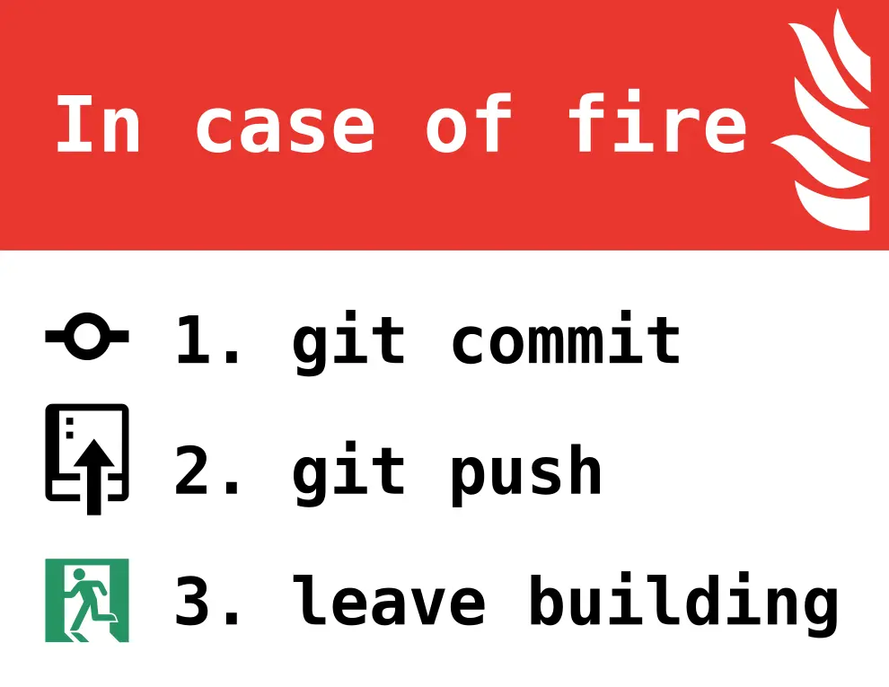

# [ポートフォリオサイトはここからご覧いただけます](https://yuu61.github.io/pro2team/)
 
> [!CAUTION] 
> 注意（超重要） コンフリクトを最小限に抑えるめに以下の取り組みを実施する
<h1>コミットは呼吸</h1>
その日の作業を終えるならコミットしろ 
そうでなくてもキリのいいところでコミットしろ
<h1>コミットは呼吸</h1>
その日の作業を終えるならコミットしろ 
そうでなくてもキリのいいところでコミットしろ
<h1>コミットは呼吸</h1>
その日の作業を終えるならコミットしろ 
そうでなくてもキリのいいところでコミットしろ
  

* 頻繁にプルとマージを行い変更を同期
  * **作業前に必ずプル**
  * **ステージ＞フェッチ＞マージ＞コミット＞プッシュ**
* 頻繫にプッシュ
  * 小さな変更でもすぐにコミットしてプッシュ
* コミットメッセージを記載する
  * 変更内容（なぜそのような変更加えたか、その意図等）をなるべく詳しく簡潔に
* 大規模な変更を行うときはブランチを切ってプルリクエストを行う
* 作業範囲について事前にコミュニケーションをとる
 

緊急時の対応については以下の通り 

## OutRow(あうとろう)チーム制作

### 関連ドキュメント
[企画概要スライド](https://chat.google.com/room/AAAAIWJng-Q/PX2c0L5HeNs/PX2c0L5HeNs?cls=10) 
[プログラム企画書](https://docs.google.com/document/d/10bhXitljOsIJgPHLzCE6j7YDnNpv7NYCNLT1jDfKky8/edit)
