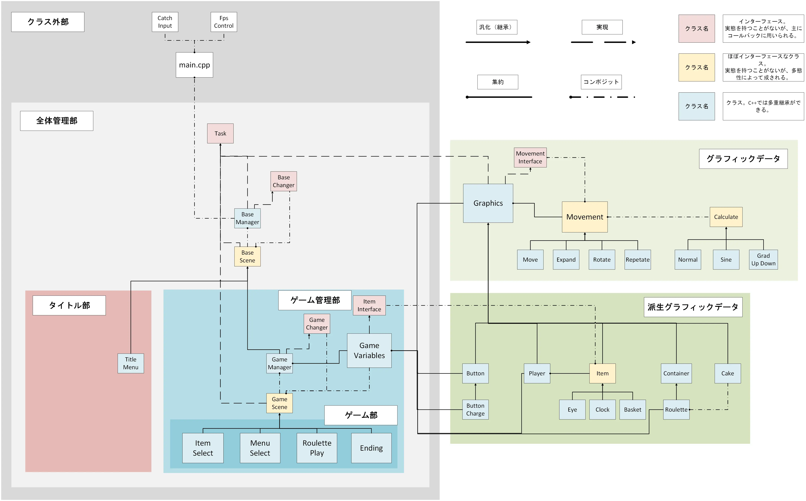

<!--
VScodeで編集した方が楽
cssとかはコパイで書いてるよ
-->
<!--直接マスターブランチで作業してるけどあんま良くないよなとは思う-->

<head>

</head>
<!--css完全に理解した
正直これでいいのかわからん。-->

<h1 align="center">右上からリポジトリもぜひ見てね</h1>
<!--wordpress側のアイキャッチ画像がピンクのユニコーンなのはそういう意味です。知らんけど-->

このページは<a href="#wordpress">PV数カウントのため</a>一度ページを開いてからリダイレクトされています
 

- [プロダクト](#プロダクト)
  - [企画概要](#企画概要)
  - [システム構成](#システム構成)
  - [機能概要](#機能概要)
  - [今後の展望](#今後の展望)
  - [開発環境および言語](#開発環境および言語)
- [ゲームについて](#ゲームについて)
- [チーム開発に当たって](#チーム開発に当たって)
  - [反省点](#反省点)
  - [開発小話](#開発小話)
  - [チームメンバー](#チームメンバー)
- [スペシャルサンクス](#スペシャルサンクス)

# プロダクト

<a href="https://github.com/yuu61/pro2team/releases" target="_blank">こちらから実際にダウンロードして遊べます</a>

## 企画概要
ルーレットを用いたオフライン対戦ゲームです。ルーレットの目押しスキルに加え、 アイテムなどのランダム要素を含めることで、カジュアルな層にもわかりやすく親しみやすいゲームを目指しました。 現状未完成のため、タイトル画面やアイテムに関わる処理が大幅に削られています。 
ゲームを作ることでアルゴリズムを学び、ユーザーが関与し楽しめるプログラムを作りたいと考えました。 この点で、ゲームは楽しみながら学べると考えました。

<!--あのゲーム「ええい儘よ」って言いながら毎回1/2外してる-->
## システム構成

<!--webpを使ってモダン(?)に。変換するやつ毎回どこに置いたか忘れて毎回DLしてる。
風の噂によるとAVIFという新勢力があるらしい-->

## 機能概要
C++を用いて作成しているため、オブジェクト指向を利用したモジュール化に挑戦しました。 ループ処理を書き換えるだけで新しいゲームが作れるほどの可用性と汎用性を目標に作成しました。 ボタンなどのゲームパーツをクラスで実装しているため、 パーツの組み合わせ次第で全く新しいシーンを製作することができます。

## 今後の展望
- 未実装のアイテムや機能の追加によるゲーム性の向上
- CMakeへの移行によるビルド環境の改善
  - ✅完了
- jekyllをGitHub Actionとして/docsをトリガーに修正
  - ✅完了

## 開発環境および言語

<table>
  <tr>
    <td>動作環境</td>
    <td>Windows 11</td>
  </tr>
  <tr>
    <td>使用言語</td>
    <td>C++</td>
  </tr>
  <tr>
    <td>ライブラリ</td>
    <td>DX ライブラリ</td>
  </tr>
  <tr>
    <td>IDE</td>
    <td>Visual Studio 2022</td>
  </tr>
  <tr>
    <td>コードエディタ</td>
    <td>VS Code</td>
  </tr>
  <tr>
    <td>バージョン管理</td>
    <td>GitHub</td>
  </tr>
  <tr>
    <td>webホスティング</td>
    <td>GitHub Pages</td>
  </tr>
  <tr>
    <td>静的サイトジェネレーター</td>
    <td>jekyll</td>
  </tr>    
</table>
 

# ゲームについて

<h2>🎂ゲーム概要🎂</h2>

「フルーツルーレット」は、回るケーキのピースを取り合い、イチゴの数を競う楽しいゲームです。 プレイヤーは順番にケーキのピースを取り、全4ラウンドのプレイで一番多くのイチゴを集めた人が勝者となります。

<h2>🍓ゲームの進め方🍓</h2>
<ul>
  <li>プレイヤーは順番にルーレットを回して、止まったところのケーキのピースを取ります。</li>
  <li>プレイヤーは4回ずつケーキを取ることができます。</li>
  <li>最後に一番多くのイチゴを集めた人が勝利します。</li>
</ul>
<h2>🎁アイテムを活用しよう！🎁</h2>
<ul>
  <li><b>イチゴのかご</b>: ケーキに乗っているイチゴの数を増やすことができます。</li>
  <li><b>懐中時計</b>: ルーレットの回転時間を長くし、チャンスを増やします。</li>
  <li><b>目</b>: 確率で手に入るアイテムが入ったピースを表示</li>  
</ul>
<h2>🌀邪魔をして相手の戦略を崩そう！🌀</h2>

他のプレイヤーがルーレットを回しているときにルーレットを揺らすなど、お邪魔をして相手の戦略を崩すこともできます。

ぜひ友達や家族と一緒に、スイーツルーレットを楽しんでください！🍰🏆🍓

<!--ここにYouTubeの埋め込みプレイヤーを[プレーヤーのコントロール バーを表示する。]のオプションにチェックを入れて貼り付け-->

  

# チーム開発に当たって
## 反省点
### 最初の抽象的な方向決めを適切に行えなかった
  - 当事者意識を持っておらず、筆者を含めPMに丸投げ状態だった

### 割とデカめの仕様変更を途中で2回挟んだ
  - 言語をC++に変更 [df7ee5a](https://github.com/yuu61/pro2team/commit/df7ee5a32985c1fc38ef0b62c8408677d5b1a422){:target="_blank"} あたり
    - C++を書いたことがない人が大半を占めた
  - 大幅にプログラムの構造を変更 [5242d35](https://github.com/yuu61/pro2team/commit/5242d35a5021f87dc997cb6a1b10007be2473a65){:target="_blank"}
    - オブジェクト指向等に慣れておらず、扱える者が一人だけになってしまった

### チームメンバーがGitHubにあまり慣れていない状態で導入
- 1月16日にdetached HEADが発覚し、修復できず大幅な変更が消失
  - 先生が全員の技術レベルを合わせるように言った意味を身をもって理解
  - 冷静に考えれば、コミットしてプッシュするのを諦めてリポジトリをzipに圧縮し、 私が手動でマージして再クローンすれば良かったのですが、 「昼休みが終わる。昼食を食べておきたい」という焦りから冷静な判断ができなかった。
  <!--PMがチームメンバーの前で変更が消失したことを謝罪した後、でも「まだ諦めていない」と明るく言った時は、正直気が気じゃなかった。本当にどうにかなりそうだった。-->
  <!--これを踏まえるとあのヤケクソREADMEも味わい深いね-->

### プログラムを書けるのが3人しかいないのなら、別のモダンな言語を選択できたのではないか
  - なるべく全員が触れられるようにしたかったため、実行に移さなかった
  <!--矛盾-->

## 開発小話
- 最初、この紹介サイトが担当者一人しか編集できないと聞いて、それはさすがに不便すぎるので全員が編集できるようにしたかった。 あとwordpressのビジュアルエディタがサイト自体のレスポンスの悪さも相まって死ぬほど使いづらい 幸いリダイレクトが許可されていたので、HTMLもCSSもJSも書けないけどMarkdownならそれなりに書けるので 何かないかと思ったら、GitHub PagesでJekyllを使ってWebホスティングができると聞いてこれを採用。 なっちゃってレスポンシブ対応はコパイにおまかせ
 

- WordPressからリダイレクトさせるとPVがカウントされずPVランキングに載らない問題が発生したため、 設定で直接このページにアクセスするのではなく、一旦WordPress側のページを読み込んでからこのページに飛ぶようにしたかった。
  - しかし、`meta http-equiv`やJavaScriptの`window.onload = function()`は保存時に自動で消されてしまい、 何とかならないかと試行錯誤していたところ、ふと「素のJS以外も使えるのでは？」と思い、 Wappalyzerで調べたところJQueryが入っていたので、`$(document).ready(function()～`を付け加えてみると成功した。
 

- 多分文字コードが原因でVisual Studioの補完機能である[IntelliSenseが動かなくなったり](https://qiita.com/yuu2461/items/7e4f090d63e8a332194f){:target="_blank"}した。
- [蛇足はコメントアウト(F12)](https://github.com/yuu61/pro2team/blob/master/docs/index.md?plain=1){:target="_blank"}

## チームメンバー
カード型表示にしたい
<table>
  <tr>
    <th>役割</th>
    <th>名前</th>
    <th>説明</th>
  </tr>
  <tr>
    <td>プロジェクトマネージャー</td>
    <td><a href="https://github.com/hziulq" target="_blank">松川</a></td>
    <td>プログラムの99割を書いたひと 頭が上がらない</td>
  </tr>
  <tr>
    <td rowspan="2">プログラマー</td>
    <td><a href="https://github.com/yuu61" target="_blank">山﨑</a></td>
    <td>自称縁下チカモチ。何もしていない GitHubのリポジトリ用意したり ホームページ用意したり。細々したこと色々 detached HEADを修復できず大幅な変更を消失させてしまった。 本当に申し訳ない</td>
  </tr>
  <tr>
    <td><a href="https://github.com/i2kmtd" target="_blank">松田</a></td>
    <td>スライドの作成、発表等</td>
  </tr>
  <tr>
    <td rowspan="4">デザイナー</td>
    <td>渡辺</td>
    <td>example text</td>
  </tr>
  <tr>
    <td>村側</td>
    <td>example text</td>
  </tr>
  <tr>
    <td>宮崎</td>
    <td>example text</td>
  </tr>
  <tr>
    <td>李</td>
    <td>example text</td>
  </tr>
</table>
<!--
## スペシャルサンクス
今回のチーム制作において、筆者は多大なるご支援を賜りました。 
特に、精神的な支えとなり、最後まで制作を続けることができたことに、 
この場をお借りして、心より御礼申し上げます。

株式会社スミレサカモト 
&nbsp;&nbsp;代表取締役　阪本良介様

合同会社ZEN HACK.BAR 
&nbsp;&nbsp;バーテンダーの皆様

他エンジニアコミュニティの皆様
-->
